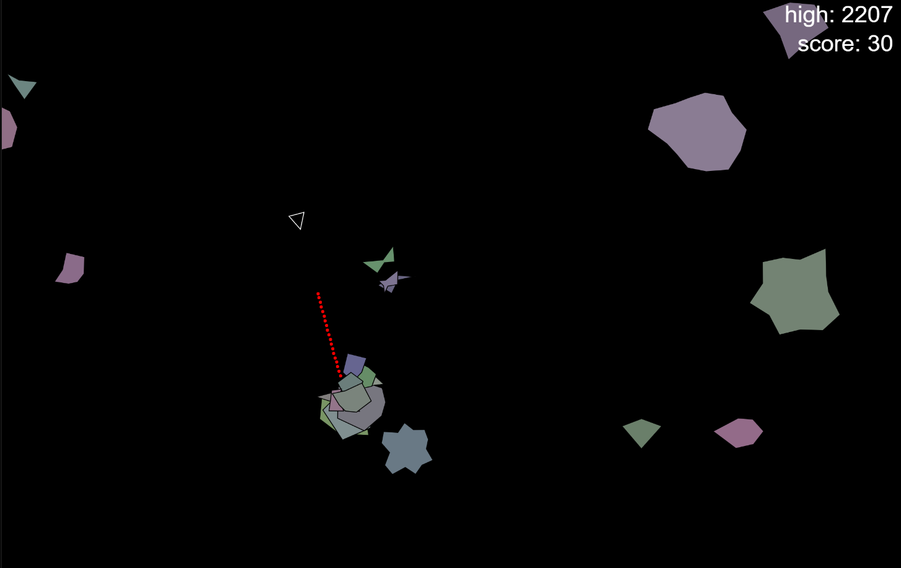

# Asteroids

This repo contains a clone of the classic [Asteroids](https://en.wikipedia.org/wiki/Asteroids_(video_game)) game from Atari in 1979.
It is written in `javascript` and `html`.  
It uses [p5.js](https://p5js.org/) for the game objects and the game rendering.  

# How to run
You can run this game by opening the [index.html](./index.html) in your browser or you can run a simple http server in the root folder of this repo e.g. (in python) `python -m http.server`

# Controls
`space bar` hold it to shoot the laser beam. 
`arrow up` hold to thrust forward. 
`arrow left/right` turn the ship left or right. 
`1` shoot 1 laser 
`2` shoot 2 lasers 
`3` guess... 
`l` shoot bullets instead of laser 
`b` shoot a laser pulse outward surrounding the ship 
`w` lay down a bomb wall in front of you 
`x` shoot a nuke (not really a big explosion, just a chain reaction of particles splitting) 
`p` pause the game 
`r` restart the game

# Features
It contains 4 levels with each level an increasing number of asteroids floating around. 
The 4th level is an infinite one where asteroids will keep spawning until the end of time.
